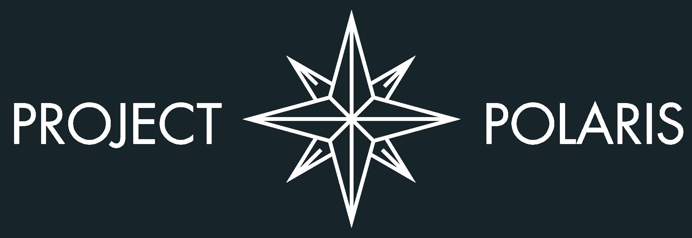

<div id="top"></div>

<h1 align="center">
   <a href="https://www.arexcr.com/projects/polaris/" target="_blank"></a><br />
   Project Title
</h1>


<!-- DESCRIPTION -->
In this section, provide a short description of the project you've made. Try not to make it too long. If you're going over three to four lines, you may have written too much. Try to be detailed but concise.


<!-- BADGES -->
[](#top)
[](#top)
[](#top)
   
<!-- Options for badges include shields.io and forthebadge.com. You're welcome to try both -->
[](https://forthebadge.com)
[](https://forthebadge.com)

---

## Table of Contents
1. [Getting Started](#getting-started)
   - [Prerequisites](#prerequisites)
   - [Installation](#installation)
2. [Usage](#usage)
3. [Support](#support)
4. [Roadmap](#roadmap)
5. [Contributing](#contributing)
6. [Authors and acknowledgment](#acknowledgments)
7. [License](#license)


<!-- GETTING STARTED -->
## Getting Started

This is an example of how you may give instructions on setting up your project locally.
To get a local copy up and running follow these simple example steps.

### Prerequisites

In this section, please explain what major libraries were used to perform your simulations. 
For Python, any libraries that are not in the standard Anaconda pre-installed packages should be listed in a file called ```environments_[file_name].yml```. This will allow others to create the exact environment you used to run your simulation and ensures cross compatibility.
Follow a similar format if you use a different language.

To install libraries in Anaconda, please see the Anaconda distribution documentation.

In general, a new environment should be used when using any combination of third party libraries for a new simulation to ensure version cross compatibility.

```yml``` files can be extracted from your anaconda environment.

### Installation
_Depending on what language and environment you are working with, you may not need this section._
If your code requires special instructions to install or build your code (e.g. C language), you should include them here.

_Below is an example of how you can instruct users on installing and setting up your app. This template doesn't rely on any external dependencies or services._

1. Get a free API Key at [https://example.com](https://example.com)
2. Clone the repo
   ```sh
   git clone https://github.com/your_username_/Project-Name.git
   ```
3. Install NPM packages
   ```sh
   npm install
   ```
4. Enter your API in `config.js`
   ```js
   const API_KEY = 'ENTER YOUR API';
   ```

<p align="right">(<a href="#top">back to top</a>)</p>


<!-- USAGE EXAMPLES -->
## Usage

Use this space to show useful examples of how a project can be used. Additional screenshots, code examples and demos work well in this space. You may also link to more resources.

You should also briefly cover the expected inputs and outputs of your program. Please keep it short as most of the details will be in the documentation. Generally, just make a short list.

_For more information, please refer to the [Documentation](https://example.com)_

<p align="right">(<a href="#top">back to top</a>)</p>


<!-- SUPPORT -->
## Support
_If you have a specific way that other people should contact you for help setting up or using your program, you should list it here._

For this example, if you have questions about this repository, you should ask your Programming Coordinator or the Head of Informatics.
For general information about everthing GitHub, the [GitHub Docs](https://docs.github.com/en) is a great resource.
Don't hesistate to reach out with any questions!

<p align="right">(<a href="#top">back to top</a>)</p>


<!-- ROADMAP -->
## Roadmap

- [x] Add back to top link
- [X] Add Changelog
- [ ] Setup contributions section
- [x] Create Projects demonstration
- [x] Create Issues demonstration
- [X] Add local images
- [x] Add local tags
- [ ] Create badge ideas or templates

See the [open issues](https://github.com/ArexCR-ProjectPolaris/example/issues) for a full list of proposed features (and known issues).

<p align="right">(<a href="#top">back to top</a>)</p>


<!-- CONTRIBUTING -->
## Contributing
This section will be standardized for all projects. We most likely will provide an additional document to cover this. In short, we acknowledge the benefits of open source software development. However, these repositories are the product of our team's work. If you'd like to contribute, we'd invite you to join Project Polaris.

For project members, we will outline the procedure for contributing your code to a repository the basic idea is as follows:
1. Create your Feature Branch (`git checkout -b feature/AmazingFeature`)
2. Commit your Changes (`git commit -m 'Add some AmazingFeature'`)
3. Push to the Branch (`git push origin feature/AmazingFeature`)
4. Open a Pull Request

<p align="right">(<a href="#top">back to top</a>)</p>


<!-- AUTHORS & ACKNOWLEDGEMENTS -->
## Acknowledgments
Use this space to list resources you find helpful and would like to give credit to. Please list all team members involved in the creation of this project.
As an example, here's the following people and resources which helped create this repository tutorial:
* John Ramthun (Head of Informatics)
* Jerry Varghese (Admin team)
* Kole McGinn (Admin team)

* [Img Shields](https://shields.io)
* [forthebadge](https://forthebadge.com)
* [GitHub Pages](https://pages.github.com)
* [Best-README-Template](https://github.com/othneildrew/Best-README-Template)
* [Make a README](https://www.makeareadme.com/)

<p align="right">(<a href="#top">back to top</a>)</p>

<!-- LICENSE -->
## License
For the duration of the Project Polaris Advanced Program, we will not be distributing code under an established license and all rights are reserved. If you are interested in contributing, we encourage you to join our team. You can find more about us [here](https://arexcr.com/projects/polaris/). At the end of the program, we plan to release all of our work for public use. We consider Open Source Software to be important and are therefore making our progress available to view during its development.

<p align="right">(<a href="#top">back to top</a>)</p>
